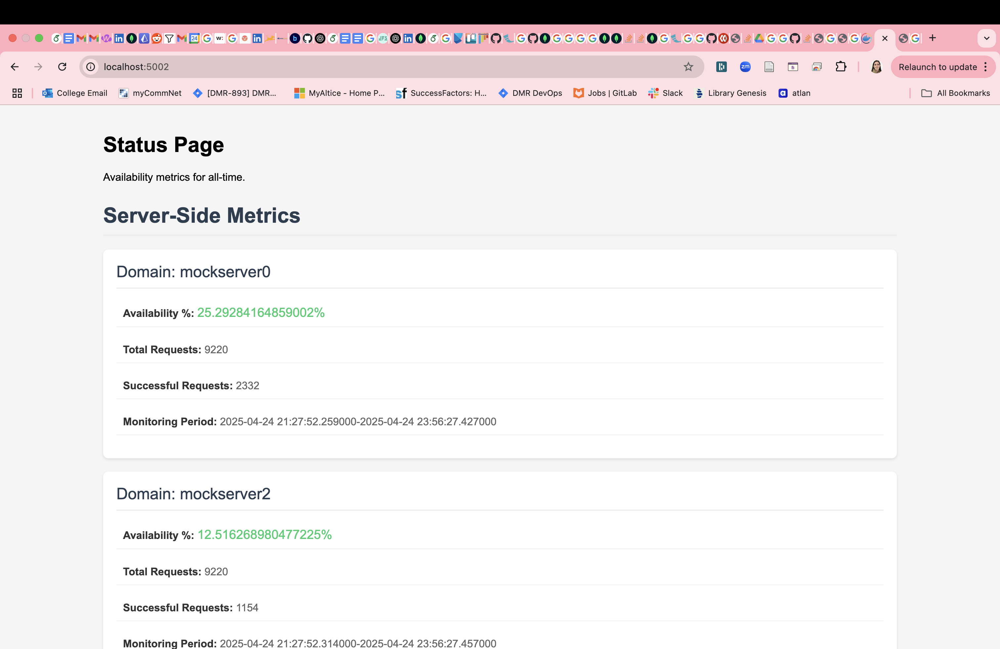
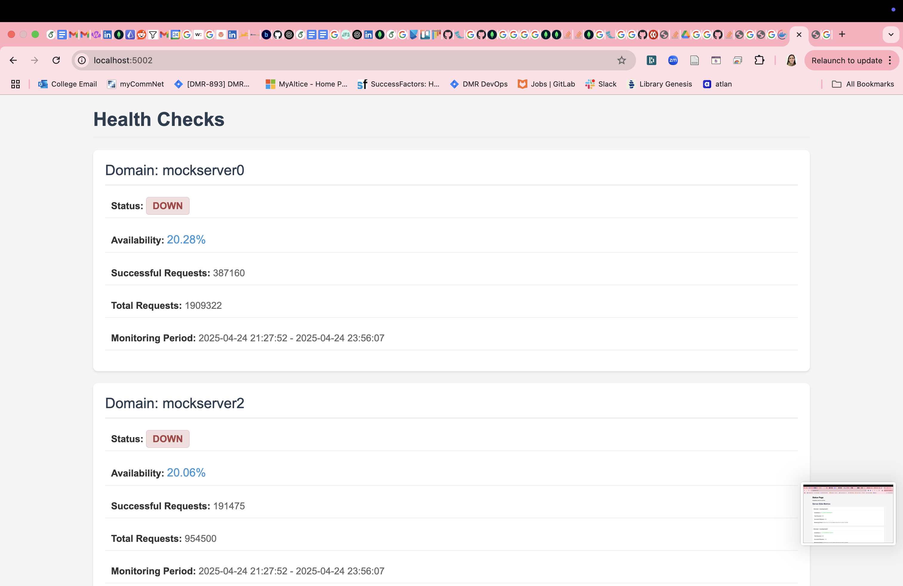
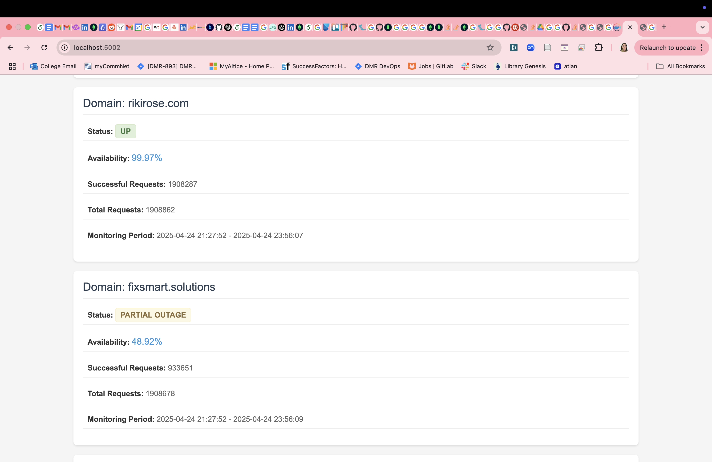

# Endpoint Monitor

This repository contains three Python applications that work together to monitor and report on HTTP endpoint availability:

1. **Monitor** - A Flask application that pings configured endpoints and records health metrics
2. **MockServer** - A Flask application that simulates endpoints with configurable failure rates
3. **Report** - A Flask application that displays availability metrics and uptime statistics

## Architecture Overview

The system consists of three main components:

### Monitor Application
- Flask application that continuously monitors configured endpoints
- Configuration is provided via a YAML file (location specified as CLI argument)
- Records health metrics to MongoDB
- Mounts configuration file via Docker Compose (default: `sample.yaml`)

### MockServer Application
- Flask application that simulates real endpoints
- Configurable failure rates via environment variables
- Uses time windows (default: 60 seconds) to determine failure patterns
- Records HTTP request metrics to MongoDB
- Useful for testing the monitoring system

### Report Application
- Flask application that displays metrics and statistics
- Shows uptime percentages based on all historical data
- Accessible at http://localhost:5002 (configurable in docker-compose.yml)
- Visualizes both health metrics and HTTP request metrics

#### Report Dashboard Overview


#### Detailed Metrics View


#### Historical Data Analysis


## Data Storage

All applications store their data in MongoDB with two main collections:
- `http_metrics`: Records of HTTP requests received by mock servers
- `health_metrics`: Health check results from the monitor application

## Prerequisites

- [Docker](https://docs.docker.com/get-docker/) and [Docker Compose](https://docs.docker.com/compose/install/)
- [Go](https://golang.org/dl/) (version 1.24)

## Setup

1. Clone this repository
2. Start all services using Docker Compose:
   ```bash
   docker-compose up -d
   ```
   This will start:
   - Monitor application
   - Three mock servers with different failure rates:
     - Server on port 5000 with 26% failure rate
     - Server on port 5001 with 50% failure rate
     - Server on port 5003 with 78% failure rate
   - Report application (accessible at http://localhost:5002)

## Configuration

### Monitor Configuration
The monitor application uses a YAML configuration file to specify which endpoints to monitor. Here's the schema:

```yaml
- name: string          # Name of the endpoint (for display purposes)
  url: string           # URL to monitor
  method: string        # HTTP method (optional, defaults to GET)
  headers:              # HTTP headers (optional)
    header-name: value
  body: string          # Request body (optional, for POST/PUT requests)
```

### MockServer Configuration
Mock servers can be configured via environment variables:
- `FLAKY_UP_RATIO`: Percentage of requests that should fail e.g. 0.25 = 25%
- `FLAKY_WINDOW`: Duration in seconds for the failure rate window

## Running the Applications

### Using Docker Compose
All applications can be run together using:
```bash
docker-compose up -d
```

## Running the Application

To run the application, use the following command:

```bash
go run main.go <config_file>
```

For example, to use the sample configuration:

```bash
go run main.go sample.yaml
```

## Viewing Metrics

Access the report application at http://localhost:5002 to view:
- Overall uptime percentages
- Historical health metrics
- HTTP request patterns
- Comparison between health checks and actual requests

## Cleanup

To stop all services:
```bash
docker-compose down
```

## Notes

- The monitor application considers an endpoint as "UP" if:
  - The response status code is between 200 and 299
  - The response time is less than 500ms
- Port mappings can be modified in the docker-compose.yml file
- The mock servers provide a realistic testing environment for the monitoring system
- Metrics are stored in MongoDB and can be analyzed for patterns and trends 